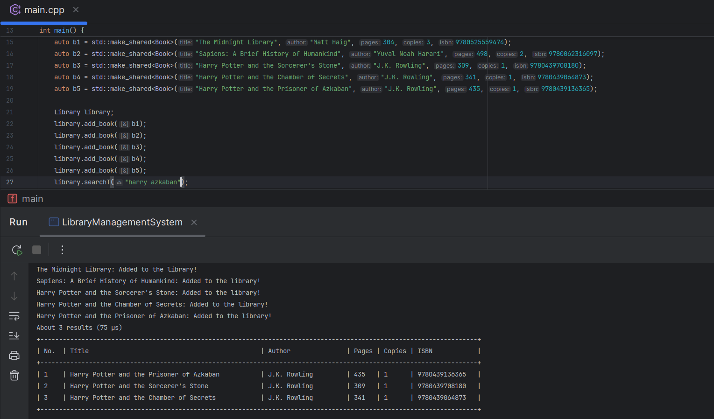
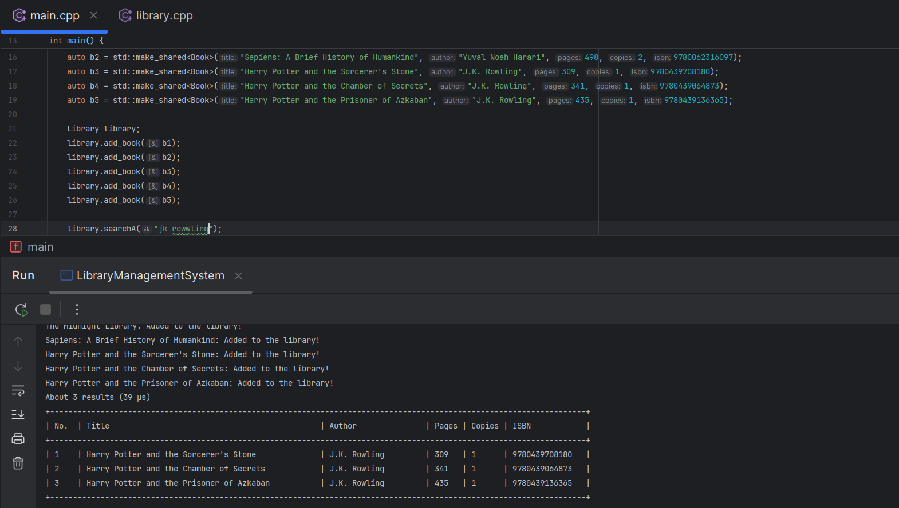
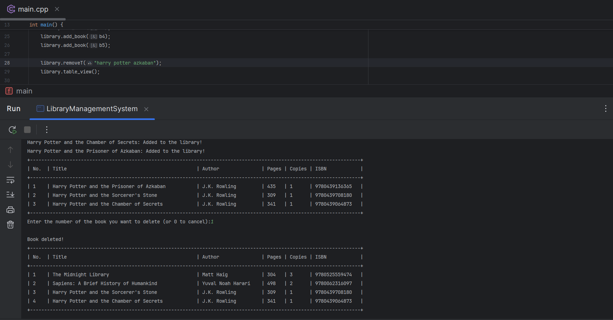
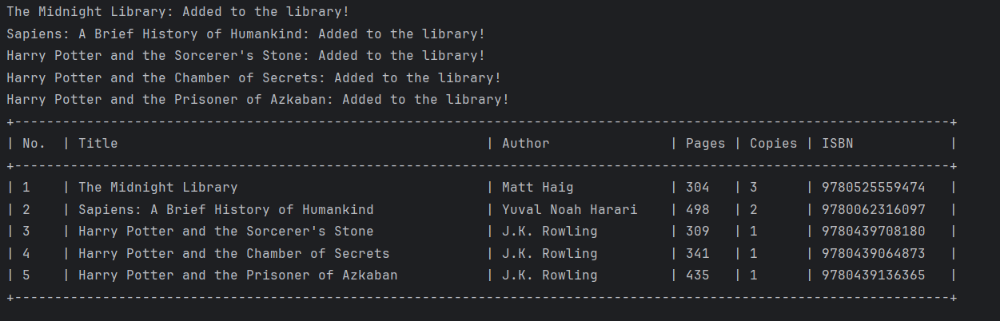
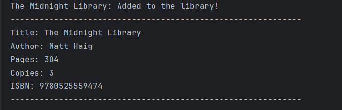

# 📚 BookRanker

**BookRanker** is a personal C++20 project focused on object-oriented programming principles and smart design. It lets you manage a library of books — adding, searching, viewing, and removing them — with a cool ranked search feature that matches books even when you don’t remember the full title.

No UI, no menus, no storage for books — just pure code. You run everything through method calls.

---

## ✨ Features

- Add books to your library
- View books in:
    - **Summary View** (quick details)
    - **Table View** (structured layout)
- Remove books (by title, author, or ISBN)
- **Search with ranking** (supports fuzzy/partial match for title/author)
    - e.g. Searching `harry azkaban` returns the full title **Harry Potter and the Prisoner of Azkaban** at the top
    - Search results are ranked by relevance
        - Google-style performance output: `About 3 results in 78 µs`
- Generic behavior via **lambda functions and templates** (reduced code repetition)

---

## 🔍 Ranked Search — Smart, Fast, and Forgiving

The crown jewel of **BookRanker** is its **ranked search system** — built for flexibility, accuracy, and speed.

You can search by **title** or **author**, even with incomplete, out-of-order, or **slightly misspelled** input — and the system returns the closest matches, ranked by how well they fit your query.

### 🧠 Why it stands out:

- ✅ **Fuzzy & partial matching**
    
    Find books even if you only remember fragments of the title or author, like `harry azkaban`.
    
- 🤖 **Misspelling tolerant**
    
    Search works even with typos. For example, an author stored as `J.K. Rowling` can still be matched by typing `jk rowwling` — it ignores punctuation and matches based on actual word content. So, atleast one word should match the title.
    
- 📊 **Scored & ranked**
    
    All matches are scored based on keyword overlap, and sorted from best to worst — so the most relevant result always shows up first.
    
- ♻️ **Generic design via templates + lambdas**
    
    Both title and author searches use the **same core logic**, thanks to a reusable templated function that injects behavior through lambdas. Clean, DRY, and extendable.
    
- 🕒 **Search time included**
    
    You get instant feedback like:
    
    `About 3 results in 64 µs` — just like Google.
    
- ⚡ **Fast and optimized**
    
    Exact matches are prioritized and returned early, skipping unnecessary work.
    

> Call .searchT("...") for title or .searchA("...") for author — both powered by the same smart engine under the hood.
> 

---

## 🛠 Tech Stack

- Language: **C++20**
- No external libraries or dependencies
- Built with an emphasis on:
    - Clean OOP structure
    - Reusability (via templates + lambdas)
    - Readability

---

## 🚀 How to Run

There’s no menu or interface — everything is method-based.

1. Clone/download the project
2. Open the source in your C++ IDE or editor
3. Start tinkering!

---

## 🧪 Usage Examples

Here’s how to interact with BookRanker through code.

---

### 📖 Creating a Book

```cpp
auto b1 = std::make_shared<Book>("The Midnight Library", "Matt Haig", 304, 3, 9780525559474);
```

- `title` and `author` and `pages` are **mandatory**
- `copies`, and `ISBN` are optional — just for realism
    - Though, specifying `ISBN` unlocks `ISBN` methods 🚀

### ➕ Adding Books to the Library

```cpp
Library library;
library.add_book(b1);
```

- **Output:**
    
    

---

### 🔍 Searching Books

### By Title

```cpp
library.searchT("harry potter")
```

- **Partial or fuzzy keyword matching** is supported (at the **word level**)
- Example: Searching `"harry azkaban"` will match
    
    `Harry Potter and the Prisoner of Azkaban`
    
- **Important:** At least one keyword must match a full word in the title —
    
    typos like `"pottr"` alone **will not work**
    
- Prioritizes **exact matches** first
- Shows results ranked by relevance
- Displays performance:
    
    *About 2 results in 41 µs*
    
- **Output:**
    
    

---

### By Author

```cpp
library.searchA("jk rowwling");
```

- Tolerates typos & ignores punctuation (e.g. `J.K. Rowling` matches `jk rowwling`)
- Same ranking logic as title

- **Output:**
    
    

---

### By ISBN

```cpp
library.searchI("9780525559474");
```

- Exact matches only (no fuzzy search)

---

### ❌ Removing Books

### By Title

```cpp
library.removeT("harry potter");
```

- Uses same logic as searchT
- Prompts for confirmation
- If multiple matches are found, a **numbered table** is shown:
    
    > "Enter the number of the book you want to remove:"
    > 

- **Output:**
    
    

### By Author

```cpp
library.removeA("matt haig");
```

---

### 👓 Viewing the Library

### Table View

```cpp
library.table_view();
```

- Shows all books in a structured table with indices

- **Output:**
    
    

### Summary View

```cpp
library.summary_view();
```

- Quick snapshot of all books — title and author only

- **Output:**
    
    

---

### 🎯 Final Thoughts

This is a fun side project that started with "what if I could search books like Google?" — and turned into a playground for C++20 features, design patterns, and just clean, satisfying code.

No libraries, no fluff — just logic, fast search, and a ton of learning baked in. I could’ve built it out fully with a UI like I did in my [CryptWarden](https://github.com/cre8tivesriram/cryptwarden) C project, but this one was all about testing myself with OOP and writing DRY, maintainable code.

Have a nice day!

---